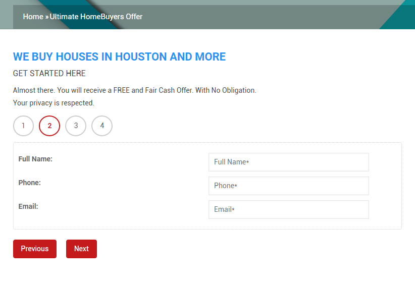
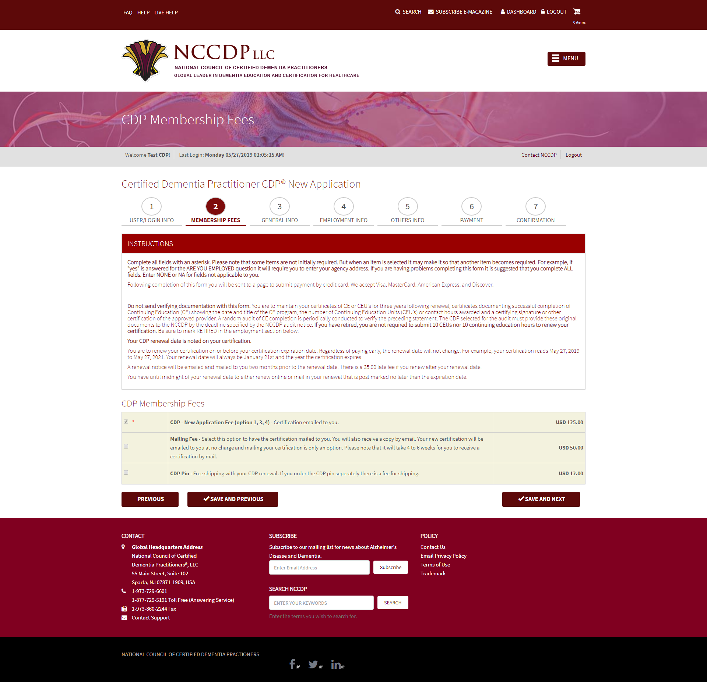

# Multi Steps Form | Membership or Information Collection
Collect information from visitor / customer in multi-steps wizard.

Definitely you can create a multi steps form using Webform with custom handler. But sometimes you many need more controll over the steps to do more customization. Like creating a membership where you want to collect lot of information and process the payment, it will be become impossible to do with webform.

In case of complex activity, you need to go for multi steps feature of Drupal 8.

Here the code is an example how you can collect some information using multi steps. Please download and rename the folder as of "ultimate_offer" to make it work.

# Example | Information Collection and Send Offer

# Example | Membership Registration

---------------------------------------------------------------
You can contact me at: <strong>Shafiq Hossain</strong>, <em>md.shafiq.hossain@gmail.com</em>
